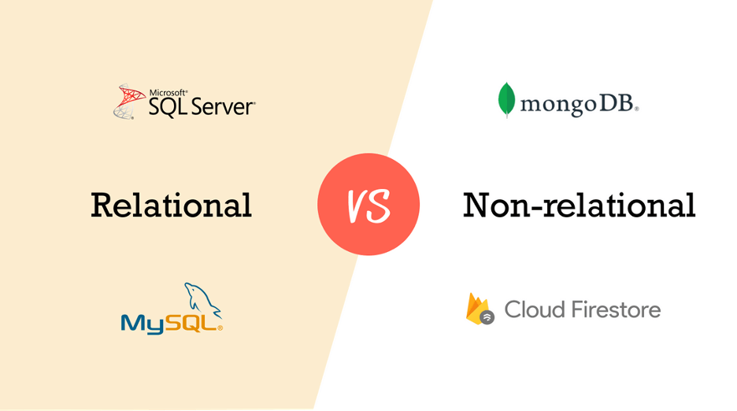
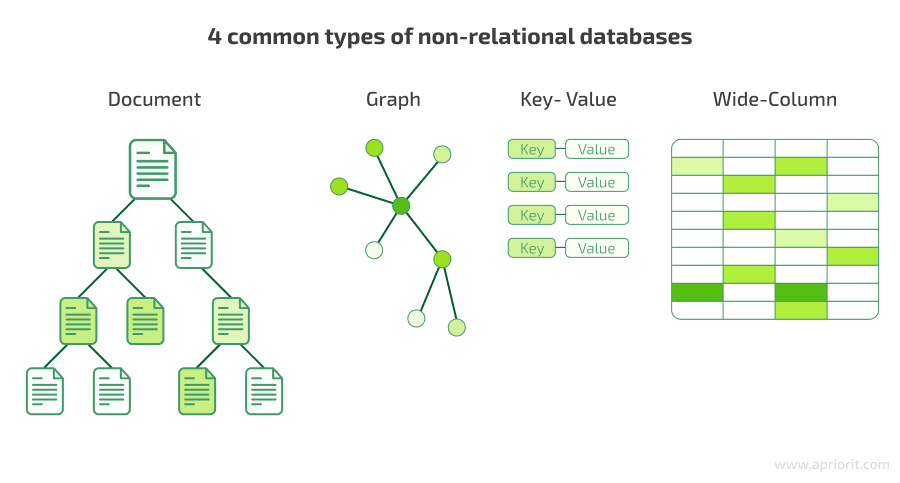
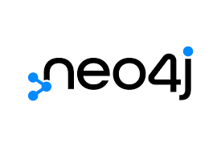

# Порівняння SQL та NoSQL баз даних

## SQL

SQL - (Structured Query Language), або мова структурованих запитів є стандартною мовою для взаємодії з реляційними базами даних. Вона дозволяє створювати, зберігати, змінювати та вилучати дані, а також управляти структурою самих баз даних. Її історія починається в 1970-х роках, коли Едгар Кодд, дослідник IBM, розробив реляційну модель даних, що стала основою сучасних реляційних систем. У 1974 році Дональд Чамберлін і Реймонд Бойс створили першу версію SQL, яка спочатку називалася SEQUEL. Ця мова швидко здобула популярність, і вже у 1980-х роках вона стала стандартом для багатьох комерційних систем баз даних, таких як Oracle та IBM DB2. 
Сьогодні SQL є невід'ємною частиною майже всіх реляційних СУБД, зокрема MySQL, PostgreSQL, Microsoft SQL Server.

Основою SQL є реляційна, або ж таблична модель даних, де інформація організована у вигляді таблиць, що складаються з рядків і стовпців. Кожна таблиця має чітко визначену структуру, відому як схема, яка включає типи даних, обов'язковість полів і зв'язки між таблицями. SQL підтримує стандарти ANSI та ISO, що забезпечує універсальність і сумісність між різними системами,  і є вагомою перевагою, спрощує розробку. Головними принципами мови є операції CRUD (Create, Read, Update, Delete), що дозволяють створювати нові дані, читати існуючі, оновлювати їх і видаляти. Крім того, SQL підтримує транзакції з ACID (Atomicity, Consistency, Isolation, and Durability) властивостями: атомарність, узгодженість, ізольованість і довговічність. Це робить її надійним інструментом для роботи в багатокористувацькому середовищі. 
SQL також дозволяє працювати зі складними запитами, зокрема об’єднання (JOIN), сортування, групування (GROUP BY) і агрегацію даних.

Проте ця мова має свої обмеження. Основний недолік — це сувора схема, яка ускладнює зміни в структурі бази. Масштабування SQL-баз даних також може бути проблематичним, особливо коли потрібне горизонтальне масштабування для великих обсягів даних. Складні об’єднання, що часто виникають у запитах, можуть знижувати продуктивність системи.

## NoSQL

З огляду на ці проблеми, а також з появою великих обсягів даних і нових завдань на початку 2000-х виникла потреба у нових підходах до зберігання та обробки інформації. Так у 2009 році з’явився термін NoSQL ("Not Only SQL") для позначення нереляційних баз даних, які не обмежені жорсткою схемою та могли зберігати неструктуровані або напівструктуровані дані, такі як JSON або XML. Їх виникнення стало відповіддю на потреби хмарних сервісів, Інтернету речей та соціальних мереж, де традиційні реляційні бази не могли забезпечити достатню швидкість і масштабованість.

NoSQL бази даних мають кілька принципових відмінностей від реляційних. По-перше, вони не вимагають чіткої схеми даних, що дозволяє легко змінювати структуру збереженої інформації. По-друге, вони підтримують різні моделі зберігання, серед основних: документи, графи, структури ключ-значення та колонки. Горизонтальне масштабування в NoSQL реалізується значно простіше, а швидкість роботи оптимізована для обробки великих обсягів даних у режимі реального часу.

**Документно-орієнтовані бази даних**

 

Документно-орієнтовані бази даних, такі як MongoDB і CouchDB, зберігають дані у вигляді документів. Документи зазвичай представлені у форматах JSON або BSON (бінарна форма JSON), що забезпечує компактність і швидшу обробку даних. BSON підтримує розширений набір типів даних, зокрема дати та бінарні дані, що робить MongoDB однією з найпотужніших систем цього типу.
Такі бази ідеально підходять для систем, де потрібно працювати з неструктурованими або часто змінюваними даними, наприклад, у хмарних сервісах, електронній комерції або мобільних додатках.

**Графові бази даних**

Графові бази даних, такі як Neo4j і Amazon Neptune, створені для зберігання та аналізу взаємозв'язків між даними. Вони представляють інформацію у вигляді вершин (об'єктів) і ребер (зв'язків між об'єктами). Такі бази ідеально підходять для соціальних мереж, рекомендаційних систем і логістичних завдань.
У запитах графові бази дозволяють легко аналізувати складні зв'язки між даними.

**Бази даних ключ-значення**

Бази даних ключ-значення, такі як Redis і DynamoDB, є найпростішими з точки зору структури. Вони зберігають дані у форматі пара ключ-значення, де ключ є унікальним ідентифікатором, а значення може бути будь-яким об'єктом.
Такі бази відмінно підходять для кешування, зберігання сесій і інших завдань, що потребують швидкого доступу до даних.

**Колонкові бази даних**

Колонкові бази даних, такі як Apache Cassandra і HBase, оптимізовані для роботи з великими обсягами даних і зберігають інформацію у форматі колонок. На відміну від традиційних рядково-орієнтованих таблиць, ці бази дозволяють зчитувати лише потрібні колонки, що значно підвищує продуктивність при аналітичних запитах.
Такі системи широко використовуються для аналізу великих даних, наприклад, у телекомунікаціях і фінансовій сфері.

## Висновок

NoSQL відзначається гнучкістю та продуктивністю, але також має свої недоліки. Відсутність стандарту означає, що кожна система має свій унікальний синтаксис і підхід до роботи. Багато NoSQL-баз не гарантують ACID-властивості, що може призводити до проблем із консистентністю даних. Крім того, складні запити, наприклад, із об’єднанням даних, реалізувати в NoSQL часто складніше.

У підсумку, SQL і NoSQL є двома підходами, які використовуються залежно від завдань. SQL ідеально підходить для структурованих даних із чіткою схемою, тоді як NoSQL краще справляється з динамічними та великими обсягами неструктурованих даних. Обидва підходи продовжують співіснувати, забезпечуючи рішення для різних викликів сучасних технологій.
