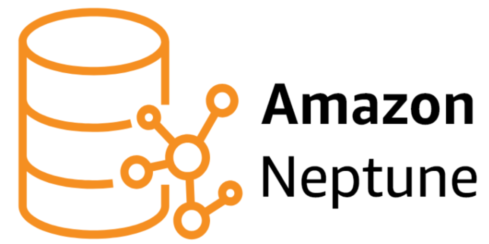

# Порівняння SQL та NoSQL баз даних


## SQL

SQL - (Structured Query Language), або мова структурованих запитів є стандартною мовою для взаємодії з реляційними базами даних. Вона дозволяє створювати, зберігати, змінювати та вилучати дані, а також управляти структурою самих баз даних. Її історія починається в 1970-х роках, коли Едгар Кодд, дослідник IBM, розробив реляційну модель даних, що стала основою сучасних реляційних систем. У 1974 році Дональд Чамберлін і Реймонд Бойс створили першу версію SQL, яка спочатку називалася SEQUEL. Ця мова швидко здобула популярність, і вже у 1980-х роках вона стала стандартом для багатьох комерційних систем баз даних, таких як Oracle та IBM DB2. 
Сьогодні SQL є невід'ємною частиною майже всіх реляційних СУБД, зокрема MySQL, PostgreSQL, Microsoft SQL Server.

Основою SQL є реляційна, або ж таблична модель даних, де інформація організована у вигляді таблиць, що складаються з рядків і стовпців. Кожна таблиця має чітко визначену структуру, відому як схема, яка включає типи даних, обов'язковість полів і зв'язки між таблицями. SQL підтримує стандарти ANSI та ISO, що забезпечує універсальність і сумісність між різними системами,  і є вагомою перевагою, спрощує розробку. Головними принципами мови є операції CRUD (Create, Read, Update, Delete), що дозволяють створювати нові дані, читати існуючі, оновлювати їх і видаляти. Крім того, SQL підтримує транзакції з ACID (Atomicity, Consistency, Isolation, and Durability) властивостями: атомарність, узгодженість, ізольованість і довговічність. Це робить її надійним інструментом для роботи в багатокористувацькому середовищі. 
SQL також дозволяє працювати зі складними запитами, зокрема об’єднання (JOIN), сортування, групування (GROUP BY) і агрегацію даних.

Проте ця мова має свої обмеження. Основний недолік — це сувора схема, яка ускладнює зміни в структурі бази. Масштабування SQL-баз даних також може бути проблематичним, особливо коли потрібне горизонтальне масштабування для великих обсягів даних. Складні об’єднання, що часто виникають у запитах, можуть знижувати продуктивність системи.

## NoSQL

З огляду на ці проблеми, а також з появою великих обсягів даних і нових завдань на початку 2000-х виникла потреба у нових підходах до зберігання та обробки інформації. Так у 2009 році з’явився термін NoSQL ("Not Only SQL") для позначення нереляційних баз даних, які не обмежені жорсткою схемою та могли зберігати неструктуровані або напівструктуровані дані, такі як JSON або XML. Їх виникнення стало відповіддю на потреби хмарних сервісів, Інтернету речей та соціальних мереж, де традиційні реляційні бази не могли забезпечити достатню швидкість і масштабованість.

NoSQL бази даних мають кілька принципових відмінностей від реляційних. По-перше, вони не вимагають чіткої схеми даних, що дозволяє легко змінювати структуру збереженої інформації. По-друге, вони підтримують різні моделі зберігання, серед основних: документи, графи, структури ключ-значення та колонки. Горизонтальне масштабування в NoSQL реалізується значно простіше, а швидкість роботи оптимізована для обробки великих обсягів даних у режимі реального часу.


**Документно-орієнтовані бази даних**

 


Документно-орієнтовані бази даних, такі як MongoDB і CouchDB, зберігають дані у вигляді документів. Документи зазвичай представлені у форматах JSON або BSON (бінарна форма JSON), що забезпечує компактність і швидшу обробку даних. BSON підтримує розширений набір типів даних, зокрема дати та бінарні дані, що робить MongoDB однією з найпотужніших систем цього типу.
Такі бази ідеально підходять для систем, де потрібно працювати з неструктурованими або часто змінюваними даними, наприклад, у хмарних сервісах, електронній комерції або мобільних додатках.

**Графові бази даних**




Графові бази даних, такі як Neo4j і Amazon Neptune, створені для зберігання та аналізу взаємозв'язків між даними. Вони представляють інформацію у вигляді вершин (об'єктів) і ребер (зв'язків між об'єктами). Такі бази ідеально підходять для соціальних мереж, рекомендаційних систем і логістичних завдань.
У запитах графові бази дозволяють легко аналізувати складні зв'язки між даними.

**Бази даних ключ-значення**

Бази даних ключ-значення, такі як Redis і DynamoDB, є найпростішими з точки зору структури. Вони зберігають дані у форматі пара ключ-значення, де ключ є унікальним ідентифікатором, а значення може бути будь-яким об'єктом.
Такі бази відмінно підходять для кешування, зберігання сесій і інших завдань, що потребують швидкого доступу до даних.

**Колонкові бази даних**


Колонкові бази даних, такі як Apache Cassandra і HBase, оптимізовані для роботи з великими обсягами даних і зберігають інформацію у форматі колонок. На відміну від традиційних рядково-орієнтованих таблиць, ці бази дозволяють зчитувати лише потрібні колонки, що значно підвищує продуктивність при аналітичних запитах.
Такі системи широко використовуються для аналізу великих даних, наприклад, у телекомунікаціях і фінансовій сфері.  

## Порівняння запитів SQL  та NoSQL на прикладі MongoDB

Основні терміни та поняття, пов'язані з обома системами, мають подібне значення, але реалізуються по-різному. У SQL таблиці використовуються для організації даних, тоді як у MongoDB ці дані зберігаються в колекціях. Кожен запис у таблиці SQL є рядком, а в MongoDB — це документ. Для покращення продуктивності обидві системи підтримують індекси. Також важливим аспектом є управління ключами: у SQL можна визначити первинний ключ для унікальних колонок, а в MongoDB цей ключ автоматично призначається полю _id.
Детальніше розглянемо ключові відмінності та особливості роботи з SQL та MongoDB, а також їх застосування в різних сценаріях.  

Створення таблиці на SQL:    
```sql
CREATE TABLE people (
    id MEDIUMINT NOT NULL
        AUTO_INCREMENT,
    user_id Varchar(30),
    age Number,
    status char(1),
    PRIMARY KEY (id)
)
```  
У MongoDB колекція неявно створюється при першій операції на кшталт insertOne() або insertMany(). Первинний ключ _id автоматично додається, якщо не вказаний:  
```javascript
db.people.insertOne( {
    user_id: "abc123",
    age: 55,
    status: "A"
 } )
```
Також можна явно створити колекцію:  
```javascript
db.createCollection("people")
```

Внесення змін у таблицю на SQL:  
```sql
ALTER TABLE people
ADD join_date DATETIME
```
```sql
ALTER TABLE people
DROP COLUMN join_date
```
Поскільки колекції не мають чіткої структури їхніх документів, то не надають можливості змінити структуру на цьому рівні. Проте на рівні документів операція updateMany() може додавати поля використовуючи $set або $unset оператори у MongoDB:  
```javascript
db.people.updateMany(
    { },
    { $set: { join_date: new Date() } }
)
```
Аналогічно updateMany() може видаляти поля з документів за допомогою $unset оператора.  
```javascript
db.people.updateMany(
    { },
    { $unset: { "join_date": "" } }
)
```  

Створення індексу під назвою idx_user_id_asc для таблиці people на основі стовпця user_id.   
```sql
CREATE INDEX idx_user_id_asc
ON people(user_id)
```  
```javascript
db.people.createIndex( { user_id: 1 } )
```

Створити композитний (або складений) індекс для таблиці people, що побудований на основі двох стовпців: user_id та age, вказано порядок сортування за спаданням можна так:  
```sql
CREATE INDEX
       idx_user_id_asc_age_desc
ON people(user_id, age DESC)
```
```javascript
db.people.createIndex( { user_id: 1, age: -1 } )
```

Видалення таблиці people з бази даних, включно з усіма її записами та структурою.
```sql
DROP TABLE people
```
```javascript
db.people.drop()
```

Приклади INSERT запитів для додавання даних:  
```sql
INSERT INTO people(user_id,
                  age,
                  status)
VALUES ("bcd001",
        45,
        "A")
```
```javascript
db.people.insertOne(
   { user_id: "bcd001", age: 45, status: "A" }
)
```

**Порівняння запитів SELECT для SQL та аналогічних в MongoDB**

Вибирає всі колонки та всі рядки з таблиці people.  
```sql
SELECT *
FROM people
```
```javascript
db.people.find()
```

Вибирає тільки колонки id, user_id і status.
```sql
SELECT id,
       user_id,
       status
FROM people
```
Повертає поля user_id та status. Поле _id за замовчуванням включається.  
```javascript
db.people.find(
    { },
    { user_id: 1, status: 1 }
)
```

Вибирає тільки user_id і status, без id.  
```sql
SELECT user_id, status
FROM people
```
Повертає user_id і status, виключаючи поле _id.  
```javascript
db.people.find(
    { },
    { user_id: 1, status: 1, _id: 0 }
)
```

Вибирає user_id та status для записів з status = "A".
```sql
SELECT user_id, status
FROM people
WHERE status = "A"
```
```javascript
db.people.find(
    { status: "A" },
    { user_id: 1, status: 1, _id: 0 }
)
```

Вибирає всі записи, де status не дорівнює "A".  
```sql
SELECT *
FROM people
WHERE status != "A"
```
```javascript
db.people.find(
    { status: { $ne: "A" } }
)
```

Фільтрує записи, де status = "A" і age = 50.
```sql
SELECT *
FROM people
WHERE status = "A"
AND age = 50
```
```javascript
db.people.find(
    { status: "A",
      age: 50 }
)
```

Фільтрує записи, де виконується хоча б одна з умов.
```sql
SELECT *
FROM people
WHERE status = "A"
OR age = 50
```
Логічний оператор $or.
```javascript
db.people.find(
    { $or: [ { status: "A" } , { age: 50 } ] }
)
```

Вибирає записи, де age більше 25.
```sql
SELECT *
FROM people
WHERE age > 25
```
Використовує оператор порівняння $gt (greater than).
```javascript
db.people.find(
    { age: { $gt: 25 } }
)
```

Вибирає всі записи з таблиці people, де значення age менше 25.
```sql
SELECT *
FROM people
WHERE age < 25
```
Використовує оператор $lt (less than), який знаходить документи з полем age, значення якого менше 25.
```javascript
db.people.find(
   { age: { $lt: 25 } }
)
```

Щоб обрати записи, де значення лежить у певному діапазоні, можна комбінувати оператори з попередніх прикладів. $lte (less than or equal).
```sql
SELECT *
FROM people
WHERE age > 25
AND   age <= 50
```
Використовує оператори $gt (greater than) і $lte (less than or equal) для визначення діапазону.
```javascript
db.people.find(
   { age: { $gt: 25, $lte: 50 } }
)
```

Вибирає всі записи, де user_id містить підрядок "bc" у будь-якому місці.
```sql
SELECT *
FROM people
WHERE user_id like "%bc%"
```

Застосовує регулярний вираз /bc/ для пошуку підрядка "bc".
```javascript
db.people.find( { user_id: /bc/ } )
```

Вибирає записи, де user_id починається з "bc".
```sql
SELECT *
FROM people
WHERE user_id like "bc%"
```

Використовує регулярний вираз /^bc/ для пошуку значень, які починаються з "bc".
```sql
db.people.find( { user_id: /^bc/ } )
```

Вибирає записи, де status = "A", і сортує їх за user_id у зростаючому порядку.
```sql
SELECT *
FROM people
WHERE status = "A"
ORDER BY user_id ASC
```
Застосовує метод .sort() з параметром { user_id: 1 }, де 1 означає сортування у зростаючому порядку.
```javascript
db.people.find( { status: "A" } ).sort( { user_id: 1 } )
```

Повертає кількість усіх записів у таблиці people.
```sql
SELECT COUNT(*)
FROM people
```
Повертає кількість усіх документів в колекції people
```javascript
db.people.count() OR db.people.find().count()
```

Підраховує кількість записів, де age > 30.
```sql
SELECT COUNT(*)
FROM people
WHERE age > 30
```
```javascript
db.people.count( { age: { $gt: 30 } } )
```
Або можна так:
```javascript
db.people.find( { age: { $gt: 30 } } ).count()
```

Повертає унікальні значення з колонки status.
```sql
SELECT DISTINCT(status)
FROM people
```
Використовує агрегацію з оператором $group, який групує документи за полем status.
```javascript
db.people.aggregate( [ { $group : { _id : "$status" } } ] )
```

Повертає перший запис із таблиці.
```sql
SELECT *
FROM people
LIMIT 1
```
```javascript
db.people.findOne()
```
Або:
```javascript
db.people.find().limit(1)
```

Повертає 5 записів, пропускаючи перші 10.
```sql
SELECT *
FROM people
LIMIT 5
SKIP 10
```
Метод .skip(10) пропускає перші 10 документів, а .limit(5) повертає наступні 5.
```javascript
db.people.find().limit(5).skip(10)
```

Показує план виконання запиту, включно з використанням індексів.
```sql
EXPLAIN SELECT *
FROM people
WHERE status = "A"
```
Використовує метод .explain(), щоб показати інформацію про виконання, наприклад, чи було використано індекси.
```javascript
db.people.find( { status: "A" } ).explain()
```

**Оновлення та видалення записів**

У таблиці people поле status змінюється на "C" для всіх записів, де age більше 25.
```sql
UPDATE people
SET status = "C"
WHERE age > 25
```
У колекції people всі документи, де age більше 25, оновлюються методом updateMany. Оператор $set змінює значення поля status на "C".
```javascript
db.people.updateMany(
   { age: { $gt: 25 } },
   { $set: { status: "C" } }
)
```

У таблиці people значення age збільшується на 3 для всіх записів, де status дорівнює "A".
```sql
UPDATE people
SET age = age + 3
WHERE status = "A"
```
У колекції people оператор $inc (increment) збільшує значення поля age на 3 для документів, що відповідають фільтру status: "A".
```javascript
db.people.updateMany(
   { status: "A" } ,
   { $inc: { age: 3 } }
)
```

У таблиці people видаляються всі записи, де status дорівнює "D".
```sql
DELETE FROM people
WHERE status = "D"
```
У колекції people методом deleteMany видаляються всі документи, де status дорівнює "D".
```javascript
db.people.deleteMany( { status: "D" } )
```

У таблиці people видаляються всі записи, але структура таблиці залишається.
```sql
DELETE FROM people
```
У колекції people методом deleteMany видаляються всі документи. Колекція залишається порожньою.
```javascript
db.people.deleteMany({})
```

## Агрегація
Агрегація JOIN у SQL
У реляційних базах даних JOIN використовується для об'єднання даних з двох або більше таблиць на основі певного критерію (зазвичай це ключові поля). JOIN дозволяє з'єднати дані, які логічно пов'язані між собою, але зберігаються в окремих таблицях.
Основні види JOIN:
**INNER JOIN**:
Повертає тільки ті рядки, які мають відповідності в обох таблицях.
```sql
SELECT employees.name, departments.name
FROM employees
INNER JOIN departments ON employees.department_id = departments.id;
```
У цьому прикладі ми отримуємо список співробітників разом із їхніми відділами, але тільки якщо у обох таблицях є відповідний запис.
**LEFT JOIN**:
Повертає всі рядки з лівої таблиці та відповідні рядки з правої таблиці. Якщо відповідність не знайдена, праві значення будуть NULL.
```sql
SELECT employees.name, departments.name
FROM employees
LEFT JOIN departments ON employees.department_id = departments.id;
```
Використовується, якщо потрібно зберегти всі дані з лівої таблиці незалежно від відповідності.
**RIGHT JOIN**:
Аналогічний до LEFT JOIN, але зберігає всі дані з правої таблиці.
```sql
SELECT employees.name, departments.name
FROM employees
RIGHT JOIN departments ON employees.department_id = departments.id;
```
**FULL OUTER JOIN**:
Повертає всі рядки з обох таблиць, заповнюючи NULL там, де немає відповідності.
```sql
SELECT employees.name, departments.name
FROM employees
FULL OUTER JOIN departments ON employees.department_id = departments.id;
```
**CROSS JOIN**:
Виконує декартовий добуток, тобто створює комбінації всіх рядків з обох таблиць.
```sql
SELECT employees.name, departments.name
FROM employees
CROSS JOIN departments;
```
JOIN часто використовується для нормалізації даних, полегшуючи їх обробку та аналіз.

**Lookup у MongoDB**
У MongoDB lookup використовується в агрегуванні для об'єднання документів з різних колекцій, подібно до JOIN у SQL. MongoDB є NoSQL-базою, тому її архітектура не передбачає природних зв'язків між колекціями, але функція $lookup дозволяє створювати зв'язки між документами.
Синтаксис $lookup:
```
{
  $lookup: {
    from: "target_collection",        // Назва колекції, з якою здійснюється об'єднання
    localField: "field_in_local",     // Поле в основній колекції
    foreignField: "field_in_foreign", // Поле у цільовій колекції
    as: "result_array"                // Ім'я масиву результатів у підсумковому документі
  }
}
```

Приклад:
Маємо дві колекції:
employees:
```json
{ "_id": 1, "name": "Alice", "department_id": 101 }
{ "_id": 2, "name": "Bob", "department_id": 102 }
```

departments:
```json
{ "_id": 101, "name": "HR" }
{ "_id": 102, "name": "Engineering" }
```

Використовуємо $lookup для об'єднання:
```javascript
db.employees.aggregate([
  {
    $lookup: {
      from: "departments",
      localField: "department_id",
      foreignField: "_id",
      as: "department_info"
    }
  }
]);
```

Результат:  
```json
[
  {
    "_id": 1,
    "name": "Alice",
    "department_id": 101,
    "department_info": [
      { "_id": 101, "name": "HR" }
    ]
  },
  {
    "_id": 2,
    "name": "Bob",
    "department_id": 102,
    "department_info": [
      { "_id": 102, "name": "Engineering" }
    ]
  }
]
```
Якщо немає відповідності, поле department_info буде порожнім масивом [].  

Аналог **INNER JOIN** для MongoDB
Для того, щоб досягти результату, який видає INNER JOIN в SQL, можна зробити так:  

Приклад:
Колекція employees:
```json
{ "_id": 1, "name": "Alice", "department_id": 101 }
{ "_id": 2, "name": "Bob", "department_id": 102 }
{ "_id": 3, "name": "Charlie", "department_id": 103 }
```
Колекція departments:
```json
{ "_id": 101, "name": "HR" }
{ "_id": 102, "name": "Engineering" }
```
```javascript
db.employees.aggregate([
  {
    $lookup: {
      from: "departments",
      localField: "department_id",
      foreignField: "_id",
      as: "department_info"
    }
  },
  {
    $match: { "department_info": { $ne: [] } } // Фільтруємо тільки ті, у яких є відповідність
  }
]);
```
Результат:
```json
[
  { "_id": 1, "name": "Alice", "department_id": 101, "department_info": [{ "_id": 101, "name": "HR" }] },
  { "_id": 2, "name": "Bob", "department_id": 102, "department_info": [{ "_id": 102, "name": "Engineering" }] }
]
```  
Аналог **LEFT JOIN** для MongoDB
LEFT JOIN у MongoDB виконується за замовчуванням за допомогою $lookup. Якщо немає відповідності, повертається порожній масив у полі as.

```javascript
db.employees.aggregate([
  {
    $lookup: {
      from: "departments",
      localField: "department_id",
      foreignField: "_id",
      as: "department_info"
    }
  }
]);
```
Результат:  
```json
[
  { "_id": 1, "name": "Alice", "department_id": 101, "department_info": [{ "_id": 101, "name": "HR" }] },
  { "_id": 2, "name": "Bob", "department_id": 102, "department_info": [{ "_id": 102, "name": "Engineering" }] },
  { "_id": 3, "name": "Charlie", "department_id": 103, "department_info": [] }
]
```

## Висновок

NoSQL відзначається гнучкістю та продуктивністю, але також має свої недоліки. Відсутність стандарту означає, що кожна система має свій унікальний синтаксис і підхід до роботи. Багато NoSQL-баз не гарантують ACID-властивості, що може призводити до проблем із консистентністю даних. Крім того, складні запити, наприклад, із об’єднанням даних, реалізувати в NoSQL часто складніше.

У підсумку, SQL і NoSQL є двома підходами, які використовуються залежно від завдань. SQL ідеально підходить для структурованих даних із чіткою схемою, тоді як NoSQL краще справляється з динамічними та великими обсягами неструктурованих даних. Обидва підходи продовжують співіснувати, забезпечуючи рішення для різних викликів сучасних технологій.
